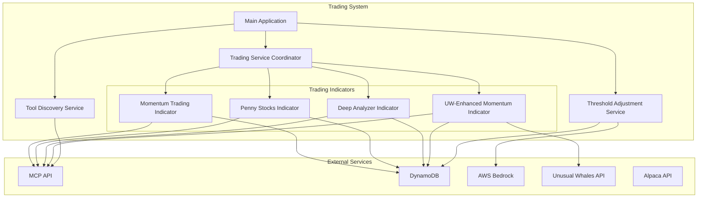

# Design Document

## Overview

The automated day trading application is a Python-based system that executes multiple trading strategies concurrently to capitalize on intraday market movements. The system integrates with external APIs (MCP API, Alpaca, AWS DynamoDB, AWS Bedrock, Unusual Whales) to obtain market data, execute trades, and store results. The architecture employs asynchronous programming with asyncio to run multiple independent trading indicators simultaneously, each with configurable entry/exit cycles and risk management parameters.

The system is designed for continuous operation during market hours, with automatic threshold adjustment via LLM analysis, intelligent ticker selection through multi-armed bandit algorithms, and comprehensive risk management including dynamic stop losses and trailing stops. All operations are logged for debugging and audit purposes, and trade data is persisted to DynamoDB for performance analysis.

## Architecture

### High-Level Architecture



### Component Architecture

The system follows a layered architecture:

1. **Application Layer**: Main entry point (`app.py`) that initializes and coordinates all services
2. **Service Layer**: Trading Service Coordinator, Tool Discovery Service, Threshold Adjustment Service
3. **Indicator Layer**: Individual trading strategy implementations (Momentum, Penny Stocks, Deep Analyzer, UW-Enhanced)
4. **Base Infrastructure Layer**: BaseTradingIndicator providing shared functionality
5. **Integration Layer**: MCP Client, DynamoDB Client, AWS Bedrock Client
6. **Configuration Layer**: Centralized trading configuration and environment variables

### Concurrency Model

The system uses Python's asyncio for concurrent execution:

- All services run as independent async tasks using `asyncio.gather()` with `return_exceptions=True`
- Each trading indicator runs two concurrent loops: entry service and exit service
- Thread-safe operations use `asyncio.Lock()` for shared state access
- Graceful shutdown via signal handlers (SIGINT, SIGTERM)

## Components and Interfaces

### 1. Main Application (`app.py`)

**Responsibility**: Application entry point and service orchestration

**Interface**:
```python
async def main() -> None:
    """Initialize and run all services concurrently"""
    
def signal_handler(signum, frame) -> None:
    """Handle shutdown signals"""
```

**Key Operations**:
- Initialize all services (Trading Service Coordinator, Tool Discovery, Threshold Adjustment)
- Set up signal handlers for graceful shutdown
- Run services concurrently with error isolation
- Clean up resources on shutdown

### 2. Trading Service Coordinator (`trading_service.py`)

**Responsibility**: Orchestrate multiple trading indicators

**Interface**:
```python
class TradingServiceCoordinator:
    async def start(self) -> None:
        """Start all enabled trading indicators"""
    
    async def stop(self) -> None:
        """Stop all trading indicators gracefully"""
```

**Key Operations**:
- Initialize enabled trading indicators (Momentum, Penny Stocks, Deep Analyzer, UW-Enhanced)
- Run indicators concurrently with error isolation
- Handle indicator failures without stopping other indicators
- Coordinate graceful shutdown

### 3. Base Trading Indicator (`base_trading_indicator.py`)

**Responsibility**: Provide shared infrastructure for all trading indicators

**Interface**:
```python
class BaseTradingIndicator(ABC):
    # Configuration
    max_active_trades: int
    max_daily_trades: int
    ticker_cooldown_minutes: int
    entry_cycle_seconds: int
    exit_cycle_seconds: int
    position_size_dollars: int
    
    # Abstract methods
    @abstractmethod
    async def entry_service(self) -> None:
        """Evaluate tickers and enter trades"""
    
    @abstractmethod
    async def exit_service(self) -> None:
        """Monitor active trades and exit when conditions met"""
    
    # Shared methods
    async def start(self) -> None:
        """Start entry and exit services"""
    
    async def stop(self) -> None:
        """Stop services and clean up"""
    
    async def is_market_open(self) -> bool:
        """Check if market is currently open"""
    
    async def get_screened_tickers(self) -> List[str]:
        """Get tickers from Alpaca screener"""
    
    async def check_cooldown(self, ticker: str) -> bool:
        """Check if ticker is in cooldown period"""
    
    async def check_daily_limits(self) -> bool:
        """Check if daily trade limits reached"""
    
    async def enter_trade(self, ticker: str, action: str, price: float, reason: str, 
                         technical_indicators: Dict, stop_loss: float) -> None:
        """Enter a trade and store in DynamoDB"""
    
    async def exit_trade(self, ticker: str, exit_price: float, reason: str,
                        technical_indicators: Dict) -> None:
        """Exit a trade and move to completed trades"""
    
    async def get_active_trades(self) -> List[Dict]:
        """Get all active trades for this indicator"""
    
    async def log_inactive_ticker(self, ticker: str, reason_long: str, 
                                  reason_short: str, technical_indicators: Dict) -> None:
        """Log why a ticker was not traded"""
```

**Key Features**:
- Market clock monitoring
- Ticker screening integration
- Cooldown management with thread-safe operations
- Daily trade limit enforcement
- DynamoDB operations (add, get, delete, update)
- MAB integration for ticker selection
- Shared HTTP session management
- Timezone handling (UTC internally, EST for market logic)

### 4. Momentum Trading Indicator (`momentum_indicator.py`)

**Responsibility**: Execute momentum-based trading strategy

**Interface**:
```python
class MomentumTradingIndicator(BaseTradingIndicator):
    # Configuration
    min_momentum_threshold: float = 1.5
    max_momentum_threshold: float = 15.0
    
    async def entry_service(self) -> None:
        """Evaluate tickers every 5 seconds for momentum signals"""
    
    async def exit_service(self) -> None:
        """Monitor active trades every 5 seconds for exit conditions"""
    
    def calculate_momentum(self, price_data: List[float]) -> float:
        """Calculate momentum from price array"""
    
    def check_technical_filters(self, market_data: Dict, direction: str) -> Tuple[bool, str]:
        """Validate technical indicators for entry"""
```

**Key Operations**:
- Calculate momentum from early 30% vs recent 30% of price data
- Apply technical filters (ADX, RSI, stochastic, Bollinger Bands, volume)
- Use MAB to select top-k tickers per direction
- Set dynamic stop loss at 2.0x ATR
- Monitor for stop loss, trailing stop, profit target, and time-based exits

### 5. Penny Stocks Indicator (`penny_stocks_indicator.py`)

**Responsibility**: Execute fast-cycle trend-following strategy for low-priced stocks

**Interface**:
```python
class PennyStocksIndicator(BaseTradingIndicator):
    # Configuration
    max_stock_price: float = 5.00
    min_stock_price: float = 0.01
    trailing_stop_percent: float = 0.5
    profit_threshold: float = 0.5
    immediate_loss_exit_threshold: float = -0.25
    exceptional_momentum_threshold: float = 8.0
    recent_bars_for_trend: int = 5
    entry_cycle_seconds: int = 1
    exit_cycle_seconds: int = 1
    min_holding_period_seconds: int = 15
    max_active_trades: int = 10
    max_daily_trades: int = 30
    
    async def entry_service(self) -> None:
        """Evaluate tickers every 1 second for trend signals"""
    
    async def exit_service(self) -> None:
        """Monitor active trades every 1 second for exit conditions"""
    
    def analyze_trend(self, bars: List[Dict]) -> Tuple[str, float]:
        """Analyze recent bars to determine trend direction"""
    
    def check_preemption(self, new_momentum: float) -> bool:
        """Check if exceptional momentum justifies preempting existing trade"""
```

**Key Operations**:
- Analyze recent 5 bars for clear trends
- Filter by price range ($0.01-$5.00), bid-ask spread, volume
- Exclude losing tickers from MAB for rest of day
- Support trade preemption for exceptional momentum (≥8%)
- Fast exit on unprofitability, trend reversal, or significant loss
- Tight trailing stop (0.5%) and quick profit target (0.5%)

### 6. Deep Analyzer Indicator (`deep_analyzer_indicator.py`)

**Responsibility**: Execute MCP API-based deep technical analysis strategy

**Interface**:
```python
class DeepAnalyzerIndicator(BaseTradingIndicator):
    # Configuration
    min_entry_score: float = 0.60
    exceptional_entry_score: float = 0.75
    top_k: int = 2
    
    async def entry_service(self) -> None:
        """Evaluate tickers every 5 seconds using MCP API"""
    
    async def exit_service(self) -> None:
        """Monitor active trades every 5 seconds for exit conditions"""
    
    async def get_entry_score(self, ticker: str, direction: str) -> float:
        """Call MCP API enter_trade to get entry score"""
    
    async def check_signal_reversal(self, ticker: str, current_direction: str) -> bool:
        """Check if opposite signal qualifies for exit"""
    
    async def check_score_degradation(self, ticker: str, entry_score: float) -> bool:
        """Check if current score dropped >50% from entry"""
```

**Key Operations**:
- Call MCP API `enter_trade()` for entry scores
- Enter trades with score ≥0.60
- Identify golden tickers (score ≥0.75) to bypass daily limits
- Check portfolio correlation (max 3 positions per direction)
- Exit on signal reversal or score degradation (>50% drop)
- Use MAB for ticker selection

### 7. UW-Enhanced Momentum Indicator (`uw_enhanced_momentum_indicator.py`)

**Responsibility**: Execute momentum strategy with Unusual Whales validation

**Interface**:
```python
class UWEnhancedMomentumIndicator(BaseTradingIndicator):
    # Configuration
    entry_cutoff_time: str = "15:00"  # 3:00 PM ET
    
    async def entry_service(self) -> None:
        """Evaluate tickers every 5 seconds with UW validation"""
    
    async def exit_service(self) -> None:
        """Monitor active trades every 5 seconds for exit conditions"""
    
    async def validate_with_unusual_whales(self, ticker: str, direction: str) -> bool:
        """Validate signal against options flow sentiment"""
    
    def calculate_risk_adjusted_position_size(self, volatility: float, 
                                              penny_stock_risk: float) -> float:
        """Calculate position size based on risk factors"""
```

**Key Operations**:
- Calculate momentum same as Momentum Trading Indicator
- Validate signals with Unusual Whales options flow
- Apply penny stock risk scoring
- Adjust position size based on volatility and risk
- No entries after 3:00 PM ET
- Wider trailing stops for shorts (1.5x multiplier)

### 8. Threshold Adjustment Service (`threshold_adjustment_service.py`)

**Responsibility**: Optimize trading thresholds using LLM analysis

**Interface**:
```python
class ThresholdAdjustmentService:
    async def start(self) -> None:
        """Start adjustment service with 5-minute cycle during market hours"""
    
    async def stop(self) -> None:
        """Stop adjustment service"""
    
    async def analyze_and_adjust(self) -> None:
        """Analyze inactive tickers and adjust thresholds"""
    
    async def query_inactive_tickers(self, minutes: int) -> List[Dict]:
        """Query inactive tickers from last N minutes"""
    
    def group_by_reason(self, inactive_tickers: List[Dict]) -> Dict[str, List[str]]:
        """Group tickers by rejection reason"""
    
    async def call_llm(self, current_thresholds: Dict, rejection_patterns: Dict) -> Dict:
        """Call AWS Bedrock LLM for threshold suggestions"""
    
    async def apply_adjustments(self, adjustments: Dict) -> None:
        """Apply threshold changes to indicator classes"""
    
    async def store_event(self, adjustments: Dict, llm_response: str) -> None:
        """Store adjustment event in DayTraderEvents table"""
```

**Key Operations**:
- Run every 5 minutes during market hours
- Query inactive tickers from last 5 minutes
- Group by rejection reason
- Call AWS Bedrock LLM with context
- Apply suggested threshold changes in-memory
- Store events for audit trail

### 9. MCP Client (`mcp_client.py`)

**Responsibility**: Interface with MCP API for market data and analysis

**Interface**:
```python
class MCPClient:
    async def call_tool(self, tool_name: str, arguments: Dict) -> Dict:
        """Call MCP API tool with retry logic"""
    
    async def get_market_clock(self) -> Dict:
        """Check if market is open"""
    
    async def get_market_data(self, ticker: str) -> Dict:
        """Get market data including technical indicators"""
    
    async def get_alpaca_screened_tickers(self) -> Dict:
        """Get gainers, losers, most active tickers"""
    
    async def get_quote(self, ticker: str) -> Dict:
        """Get current bid/ask prices"""
    
    async def enter_trade(self, ticker: str, direction: str) -> Dict:
        """Get entry signal and score"""
    
    async def exit_trade(self, ticker: str, direction: str) -> Dict:
        """Get exit signal"""
    
    async def send_webhook_signal(self, signal_data: Dict) -> None:
        """Send trading signal to webhook endpoints"""
```

**Key Features**:
- HTTP POST requests with Bearer token authentication
- Exponential backoff retry logic
- Shared HTTP session for efficiency
- Comprehensive error logging

### 10. DynamoDB Client (`dynamodb_client.py`)

**Responsibility**: Interface with DynamoDB for data persistence

**Interface**:
```python
class DynamoDBClient:
    async def put_item(self, table_name: str, item: Dict) -> bool:
        """Insert item into table"""
    
    async def get_item(self, table_name: str, key: Dict) -> Optional[Dict]:
        """Retrieve item by key"""
    
    async def delete_item(self, table_name: str, key: Dict) -> bool:
        """Delete item by key"""
    
    async def query(self, table_name: str, key_condition: str, 
                   expression_values: Dict) -> List[Dict]:
        """Query table with conditions"""
    
    async def scan(self, table_name: str, filter_expression: str = None) -> List[Dict]:
        """Scan table with optional filter"""
    
    async def update_item(self, table_name: str, key: Dict, 
                         update_expression: str, expression_values: Dict) -> bool:
        """Update item attributes"""
```

**Key Features**:
- Async operations using aioboto3
- Error handling with detailed logging
- Graceful degradation on failures
- Support for all DynamoDB operations

### 11. MAB Service (`mab_service.py`)

**Responsibility**: Implement multi-armed bandit algorithm for ticker selection

**Interface**:
```python
class MABService:
    async def select_tickers(self, indicator: str, candidates: List[str], 
                            direction: str, top_k: int) -> List[str]:
        """Select top-k tickers using Thompson Sampling"""
    
    async def update_stats(self, indicator: str, ticker: str, 
                          success: bool) -> None:
        """Update MAB statistics after trade completion"""
    
    async def get_stats(self, indicator: str, ticker: str) -> Dict:
        """Get current statistics for indicator#ticker"""
    
    async def exclude_ticker(self, indicator: str, ticker: str, 
                            duration: str = "day") -> None:
        """Exclude ticker from selection for specified duration"""
    
    def thompson_sampling(self, stats: List[Dict]) -> List[int]:
        """Perform Thompson Sampling to rank tickers"""
```

**Key Features**:
- Thompson Sampling for exploration/exploitation balance
- Separate statistics per indicator#ticker combination
- Support for temporary ticker exclusion
- Persistent storage in MABStats DynamoDB table

## Data Models

### Active Trade

```python
@dataclass
class ActiveTrade:
    ticker: str
    action: str  # "buy_to_open" or "sell_to_open"
    indicator: str
    enter_price: float
    enter_reason: str
    technical_indicators_for_enter: Dict[str, Any]
    dynamic_stop_loss: float
    trailing_stop: float
    peak_profit_percent: float
    entry_score: Optional[float]  # For Deep Analyzer
    created_at: str  # ISO timestamp in UTC
```

**DynamoDB Table**: `ActiveTickersForAutomatedDayTrader`
- Partition Key: `ticker` (String)

### Completed Trade

```python
@dataclass
class CompletedTrade:
    date: str  # yyyy-mm-dd
    ticker: str
    indicator: str
    action: str
    enter_price: float
    exit_price: float
    enter_timestamp: str  # ISO timestamp in UTC
    exit_timestamp: str  # ISO timestamp in UTC
    profit_or_loss: float
    enter_reason: str
    exit_reason: str
    technical_indicators_for_enter: Dict[str, Any]
    technical_indicators_for_exit: Dict[str, Any]
```

**DynamoDB Table**: `CompletedTradesForMarketData`
- Partition Key: `date` (String)
- Sort Key: `ticker#indicator` (String)

### Inactive Ticker

```python
@dataclass
class InactiveTicker:
    ticker: str
    indicator: str
    timestamp: str  # ISO timestamp in UTC
    reason_not_to_enter_long: str
    reason_not_to_enter_short: str
    technical_indicators: Dict[str, Any]
```

**DynamoDB Table**: `InactiveTickersForDayTrading`
- Partition Key: `ticker` (String)
- Sort Key: `timestamp` (String)

### Threshold Adjustment Event

```python
@dataclass
class ThresholdAdjustmentEvent:
    date: str  # yyyy-mm-dd
    indicator: str
    last_updated: str  # ISO timestamp in EST
    threshold_change: Dict[str, Any]  # Old and new values
    max_long_trades: int
    max_short_trades: int
    llm_response: str
```

**DynamoDB Table**: `DayTraderEvents`
- Partition Key: `date` (String)
- Sort Key: `indicator` (String)

### MAB Statistics

```python
@dataclass
class MABStats:
    indicator_ticker: str  # "indicator#ticker"
    successes: int
    failures: int
    total_trades: int
    last_updated: str  # ISO timestamp in UTC
    excluded_until: Optional[str]  # ISO timestamp for temporary exclusion
```

**DynamoDB Table**: `MABStats`
- Partition Key: `indicator#ticker` (String)

### Market Data

```python
@dataclass
class MarketData:
    ticker: str
    current_price: float
    bid: float
    ask: float
    volume: int
    datetime_price: List[float]  # Price history
    technical_indicators: Dict[str, Any]  # ADX, RSI, stochastic, Bollinger Bands, etc.
    atr: float
```

### Trading Configuration

```python
@dataclass
class TradingConfig:
    # ATR Multipliers
    STOP_LOSS_ATR_MULTIPLIER: float = 2.0
    TRAILING_STOP_ATR_MULTIPLIER: float = 1.5
    
    # Stop Loss Bounds
    PENNY_STOCK_STOP_LOSS_MIN: float = -0.08  # -8%
    PENNY_STOCK_STOP_LOSS_MAX: float = -0.04  # -4%
    STANDARD_STOCK_STOP_LOSS_MIN: float = -0.06  # -6%
    STANDARD_STOCK_STOP_LOSS_MAX: float = -0.04  # -4%
    
    # Trailing Stop Bounds
    TRAILING_STOP_BASE: float = 0.02  # 2%
    TRAILING_STOP_SHORT_MULTIPLIER: float = 1.5
    TRAILING_STOP_SHORT_MAX: float = 0.04  # 4%
```

**File**: `trading_config.py`


## Correctness Properties

*A property is a characteristic or behavior that should hold true across all valid executions of a system-essentially, a formal statement about what the system should do. Properties serve as the bridge between human-readable specifications and machine-verifiable correctness guarantees.*

### Property 1: Error Isolation

*For any* trading indicator that encounters an error, all other trading indicators should continue operating without interruption.
**Validates: Requirements 1.2**

### Property 2: Thread-Safe Concurrent Access

*For any* ticker being evaluated by multiple trading indicators simultaneously, all shared state operations should complete without data corruption or race conditions.
**Validates: Requirements 1.4**

### Property 3: Momentum Calculation Consistency

*For any* price data array, the momentum calculation should equal the percentage change between the average of the early 30% of prices and the average of the recent 30% of prices.
**Validates: Requirements 2.1**

### Property 4: Long Entry Conditions

*For any* ticker with upward momentum between 1.5% and 15%, the Momentum Trading Indicator should enter a long position if and only if all technical filters are met (ADX ≥20, RSI 45-70, stochastic confirmation, Bollinger Band position, volume >1.5x SMA, price >$0.10).
**Validates: Requirements 2.2**

### Property 5: Short Entry Conditions

*For any* ticker with downward momentum between -15% and -1.5%, the Momentum Trading Indicator should enter a short position if and only if all technical filters are met (ADX ≥20, RSI ≥50, stochastic confirmation, Bollinger Band position, volume >1.5x SMA, price >$0.10).
**Validates: Requirements 2.3**

### Property 6: MAB Ticker Selection

*For any* set of candidate tickers, the MAB algorithm should return exactly top-k tickers per direction, ranked by Thompson Sampling based on historical success rates.
**Validates: Requirements 2.4, 8.1**

### Property 7: Trade Entry Parameters

*For any* trade entered by the Momentum Trading Indicator, the dynamic stop loss should equal 2.0x ATR (capped by bounds) and the position size should equal $2000.
**Validates: Requirements 2.5**

### Property 8: Penny Stock Trend Analysis

*For any* sequence of 5 price bars, the trend analysis should correctly identify whether a clear upward, downward, or no clear trend exists based on the trend continuation percentage.
**Validates: Requirements 3.1**

### Property 9: Penny Stock Long Entry Conditions

*For any* ticker with price between $0.01 and $5.00, the Penny Stocks Indicator should enter a long position if and only if there is a clear upward trend, momentum between 1.5% and 15%, ≥50% trend continuation, and the ticker is not at a peak.
**Validates: Requirements 3.2**

### Property 10: Penny Stock Short Entry Conditions

*For any* ticker with price between $0.01 and $5.00, the Penny Stocks Indicator should enter a short position if and only if there is a clear downward trend, momentum between 1.5% and 15%, ≥50% trend continuation, and the ticker is not at a bottom.
**Validates: Requirements 3.3**

### Property 11: Penny Stock Filtering

*For any* ticker evaluated by the Penny Stocks Indicator, the ticker should be filtered out if it has bid-ask spread >2%, volume <500 shares in recent bars, is a special security (warrant, right, unit), or lost money today.
**Validates: Requirements 3.4**

### Property 12: Trade Preemption

*For any* active trade with low profit, when a new ticker shows exceptional momentum ≥8%, the Penny Stocks Indicator should preempt the low-profit trade to enter the exceptional opportunity.
**Validates: Requirements 3.5**

### Property 13: Deep Analyzer Entry Score Threshold

*For any* ticker with entry score ≥0.60 and portfolio with fewer than 3 positions in the same direction, the Deep Analyzer Indicator should enter a trade and store the entry score.
**Validates: Requirements 4.2**

### Property 14: Golden Ticker Bypass

*For any* ticker with entry score ≥0.75 (golden ticker), the Deep Analyzer Indicator should bypass daily trade limits for that entry.
**Validates: Requirements 4.3**

### Property 15: Signal Reversal Exit

*For any* active trade in the Deep Analyzer, when the MCP API returns a qualifying signal in the opposite direction, the indicator should exit the trade.
**Validates: Requirements 4.4**

### Property 16: Score Degradation Exit

*For any* active trade in the Deep Analyzer, when the current entry score drops more than 50% from the stored entry score, the indicator should exit the trade.
**Validates: Requirements 4.5**

### Property 17: UW Momentum Calculation Consistency

*For any* price data array, the UW-Enhanced Momentum Indicator should calculate momentum using the same method as the Momentum Trading Indicator.
**Validates: Requirements 5.1**

### Property 18: UW Validation Before Entry

*For any* ticker with qualifying momentum, the UW-Enhanced Momentum Indicator should call the Unusual Whales API to validate sentiment before entering a trade.
**Validates: Requirements 5.2**

### Property 19: Risk-Adjusted Position Sizing

*For any* ticker, the UW-Enhanced Momentum Indicator should adjust position size based on volatility and penny stock risk, with higher risk resulting in smaller position sizes.
**Validates: Requirements 5.3**

### Property 20: Time-Based Entry Cutoff

*For any* time after 3:00 PM ET, the UW-Enhanced Momentum Indicator should not enter any new trades.
**Validates: Requirements 5.4**

### Property 21: Short Trailing Stop Multiplier

*For any* short position in the UW-Enhanced Momentum Indicator, the trailing stop should be calculated with a 1.5x multiplier to create a wider stop.
**Validates: Requirements 5.5**

### Property 22: Hard Stop Loss Exit

*For any* active trade that reaches the hard stop loss threshold, the trading indicator should immediately exit the trade.
**Validates: Requirements 6.1**

### Property 23: Trailing Stop Activation

*For any* active trade that reaches the profit threshold, the trading indicator should activate a trailing stop at 1.5x ATR.
**Validates: Requirements 6.2**

### Property 24: Trailing Stop Exit

*For any* active trade with an activated trailing stop, when the price moves against the position beyond the trailing stop distance from peak profit, the trading indicator should exit the trade.
**Validates: Requirements 6.3**

### Property 25: End-of-Day Forced Closure

*For any* time within 15 minutes of market close, all trading indicators should force close all active trades.
**Validates: Requirements 6.4**

### Property 26: Minimum Holding Period

*For any* active trade held for less than the minimum holding period, the trading indicator should not exit the trade unless the hard stop loss is hit.
**Validates: Requirements 6.5**

### Property 27: Active Trade Storage

*For any* trade entered by a trading indicator, the trade details should be stored in the ActiveTickersForAutomatedDayTrader table with ticker as partition key.
**Validates: Requirements 7.1**

### Property 28: Trade Movement on Exit

*For any* trade exited by a trading indicator, the trade should be removed from ActiveTickersForAutomatedDayTrader and added to CompletedTradesForMarketData with date as partition key and ticker#indicator as sort key.
**Validates: Requirements 7.2**

### Property 29: Inactive Ticker Logging

*For any* ticker evaluated but not entered by a trading indicator, the rejection reason should be logged in InactiveTickersForDayTrading with ticker as partition key and timestamp as sort key.
**Validates: Requirements 7.3**

### Property 30: Threshold Adjustment Event Storage

*For any* threshold adjustment made by the Threshold Adjustment Service, the event should be stored in DayTraderEvents with date as partition key and indicator as sort key.
**Validates: Requirements 7.4**

### Property 31: DynamoDB Error Handling

*For any* DynamoDB operation that fails, the trading system should log the error with full details and continue operating.
**Validates: Requirements 7.5**

### Property 32: MAB Statistics Separation

*For any* ticker evaluated by the MAB algorithm, statistics should be maintained separately for each indicator#ticker combination in the MABStats table.
**Validates: Requirements 8.2**

### Property 33: MAB Statistics Update

*For any* completed trade, the MAB statistics for that indicator#ticker combination should be updated.
**Validates: Requirements 8.3**

### Property 34: Losing Ticker Exclusion

*For any* losing trade recorded by the Penny Stocks Indicator, that ticker should be excluded from MAB selection for the remainder of the trading day.
**Validates: Requirements 8.4**

### Property 35: MAB Direction Separation

*For any* MAB selection request, the algorithm should return separate ranked lists for long and short directions.
**Validates: Requirements 8.5**

### Property 36: Inactive Ticker Query Time Range

*For any* threshold adjustment cycle, the service should query inactive tickers from exactly the last 5 minutes.
**Validates: Requirements 9.1**

### Property 37: Rejection Reason Grouping

*For any* set of inactive ticker data, the Threshold Adjustment Service should correctly group tickers by rejection reason.
**Validates: Requirements 9.2**

### Property 38: LLM Threshold Adjustment Call

*For any* threshold adjustment cycle with rejection patterns, the service should call AWS Bedrock LLM with current thresholds and rejection patterns.
**Validates: Requirements 9.3**

### Property 39: In-Memory Threshold Application

*For any* threshold suggestions received from the LLM, the Threshold Adjustment Service should apply the changes to the trading indicator classes in memory.
**Validates: Requirements 9.4**

### Property 40: Threshold Adjustment Event Completeness

*For any* completed threshold adjustment cycle, the stored event should include threshold changes, max trades recommendations, and full LLM response.
**Validates: Requirements 9.5**

### Property 41: MCP API Authentication

*For any* MCP API call, the trading system should use HTTP POST requests with Bearer token authentication via the Authorization header.
**Validates: Requirements 10.4**

### Property 42: MCP API Retry Logic

*For any* failed MCP API call, the trading system should log the error with full details and retry with exponential backoff.
**Validates: Requirements 10.5**

### Property 43: Dynamic Stop Loss Calculation

*For any* ticker, the calculated dynamic stop loss should equal 2.0x ATR, capped between -4% and -8% for penny stocks or -4% and -6% for standard stocks.
**Validates: Requirements 11.1**

### Property 44: Position Size Calculation

*For any* ticker, the calculated position size should start at $2000 and be reduced for high-volatility stocks and high-risk penny stocks, with a minimum of $500.
**Validates: Requirements 11.2**

### Property 45: Entry Filtering

*For any* ticker evaluated for entry, the trading indicator should filter out tickers with momentum <1.5% or >15%, ADX <20, volume ≤1.5x SMA, or price <$0.10.
**Validates: Requirements 11.3**

### Property 46: Active Trade Limit Enforcement

*For any* trading indicator at its max_active_trades limit, the indicator should not enter new trades until an active trade is closed.
**Validates: Requirements 11.4**

### Property 47: Daily Trade Limit Enforcement

*For any* trading indicator at its max_daily_trades limit, the indicator should not enter new trades unless the ticker is a golden ticker.
**Validates: Requirements 11.5**

### Property 48: Cooldown Timestamp Recording

*For any* trade exited by a trading indicator, the exit timestamp should be recorded for that ticker.
**Validates: Requirements 12.1**

### Property 49: Cooldown Period Enforcement

*For any* ticker traded within the last 60 minutes, the trading indicator should skip that ticker due to cooldown period.
**Validates: Requirements 12.2**

### Property 50: Thread-Safe Cooldown Checks

*For any* cooldown period check, the trading indicator should use thread-safe operations to prevent race conditions.
**Validates: Requirements 12.3**

### Property 51: Golden Ticker Cooldown Bypass

*For any* golden ticker, the trading indicator should bypass the cooldown period restriction.
**Validates: Requirements 12.4**

### Property 52: Daily Cooldown Reset

*For any* trading day end, the trading system should clear all cooldown period records for the next trading day.
**Validates: Requirements 12.5**

### Property 53: Entry Webhook Notification

*For any* trade entered by a trading indicator, the trading system should call the MCP API send_webhook_signal tool with trade entry details.
**Validates: Requirements 13.1**

### Property 54: Exit Webhook Notification

*For any* trade exited by a trading indicator, the trading system should call the MCP API send_webhook_signal tool with trade exit details and profit/loss.
**Validates: Requirements 13.2**

### Property 55: Webhook Payload Completeness

*For any* webhook signal sent, the payload should include ticker, action, price, reason, technical indicators, and indicator name.
**Validates: Requirements 13.3**

### Property 56: Webhook Error Handling

*For any* failed webhook call, the trading system should log the error but continue normal operation.
**Validates: Requirements 13.4**

### Property 57: Multi-Webhook Notification

*For any* configured webhook URLs, the trading system should send notifications to all configured endpoints.
**Validates: Requirements 13.5**

### Property 58: Market Clock Check Before Operations

*For any* operation performed by a trading indicator, the indicator should first check the market clock to verify the market is open.
**Validates: Requirements 14.1**

### Property 59: Closed Market Operation Skip

*For any* operation when the market clock indicates closed, the trading indicator should skip the operation and wait for the next cycle.
**Validates: Requirements 14.2**

### Property 60: UTC Timestamp Storage

*For any* timestamp stored by the trading system, the timestamp should be in UTC format.
**Validates: Requirements 14.3**

### Property 61: EST Timezone Conversion for Market Logic

*For any* market-hour logic operation (e.g., end-of-day closure), the trading system should convert to EST timezone for comparison.
**Validates: Requirements 14.4**

### Property 62: Tool Cache Refresh Interval

*For any* 5-minute interval, the Tool Discovery Service should refresh the tool cache.
**Validates: Requirements 15.2**

### Property 63: HTTP Fallback for Tool Discovery

*For any* tool discovery operation, the Tool Discovery Service should use HTTP fallback for compatibility with the MCP server.
**Validates: Requirements 15.3**

### Property 64: Cached Tool Query

*For any* tool metadata request, the trading indicator should query the cached tool list from the Tool Discovery Service instead of making API calls.
**Validates: Requirements 15.4**

### Property 65: Tool Discovery Error Retry

*For any* error encountered by the Tool Discovery Service, the service should log the error and retry on the next cycle.
**Validates: Requirements 15.5**

### Property 66: Structured Operation Logging

*For any* operation performed by the trading system, the system should log the operation with structured data using Loguru.
**Validates: Requirements 16.1**

### Property 67: Signal Logging Completeness

*For any* entry or exit signal generated by a trading indicator, the indicator should log the signal with ticker, reason, and technical indicators.
**Validates: Requirements 16.2**

### Property 68: Error Stack Trace Logging

*For any* error encountered by the trading system, the system should log the error with full stack trace.
**Validates: Requirements 16.3**

### Property 69: DynamoDB Operation Logging

*For any* DynamoDB operation performed, the trading system should log the operation type, table name, and success/failure status.
**Validates: Requirements 16.4**

### Property 70: Threshold Adjustment Logging Completeness

*For any* threshold modification by the Threshold Adjustment Service, the service should log the old values, new values, and LLM reasoning.
**Validates: Requirements 16.5**

### Property 71: Environment Variable Configuration

*For any* environment variable configured as Heroku config var, the trading system should read and use that value for configuration.
**Validates: Requirements 17.3**

### Property 72: Long Entry Pricing

*For any* long position entered by a trading indicator, the entry price should equal the ask price.
**Validates: Requirements 18.1**

### Property 73: Long Exit Pricing

*For any* long position exited by a trading indicator, the exit price should equal the bid price.
**Validates: Requirements 18.2**

### Property 74: Short Entry Pricing

*For any* short position entered by a trading indicator, the entry price should equal the bid price.
**Validates: Requirements 18.3**

### Property 75: Short Exit Pricing

*For any* short position exited by a trading indicator, the exit price should equal the ask price.
**Validates: Requirements 18.4**

### Property 76: Profit/Loss Calculation Correctness

*For any* trade, the profit or loss calculation should use the correct entry and exit prices based on position direction (ask for long entry, bid for long exit, bid for short entry, ask for short exit).
**Validates: Requirements 18.5**

### Property 77: Stop Loss ATR Multiplier Consistency

*For any* stop loss calculation by any trading indicator, the calculation should use the standardized 2.0x ATR multiplier from trading_config.py.
**Validates: Requirements 19.1**

### Property 78: Trailing Stop ATR Multiplier Consistency

*For any* trailing stop calculation by any trading indicator, the calculation should use the standardized 1.5x ATR multiplier from trading_config.py.
**Validates: Requirements 19.2**

### Property 79: Stop Loss Bounds Consistency

*For any* stop loss bounds applied by any trading indicator, the bounds should match the standardized values from trading_config.py (-8% to -4% for penny stocks, -6% to -4% for standard stocks).
**Validates: Requirements 19.3**

### Property 80: Trailing Stop Bounds Consistency

*For any* trailing stop bounds applied by any trading indicator, the bounds should match the standardized values from trading_config.py (2.0% base, 1.5x multiplier for shorts).
**Validates: Requirements 19.4**

### Property 81: Shared HTTP Session Usage

*For any* set of HTTP requests to the MCP API, the trading system should use a shared HTTP session across all requests.
**Validates: Requirements 20.1**

### Property 82: Resource Cleanup on Stop

*For any* trading indicator that stops, all HTTP sessions and resources should be closed and cleaned up.
**Validates: Requirements 20.2**

### Property 83: LRU Cache Size Limit

*For any* LRU cache used by the trading system, the cache size should not exceed 500 entries.
**Validates: Requirements 20.3**

### Property 84: Thread-Safe Resource Access

*For any* shared resource accessed by multiple trading indicators, the trading system should use async locks to ensure thread safety.
**Validates: Requirements 20.4**

### Property 85: Graceful Shutdown Resource Release

*For any* trading system shutdown, all connections should be gracefully closed and all resources should be released.
**Validates: Requirements 20.5**

## Error Handling

### Error Categories

1. **Network Errors**
   - MCP API connection failures
   - Timeout errors
   - DNS resolution failures
   - **Handling**: Exponential backoff retry (max 3 attempts), log error, continue operation

2. **Database Errors**
   - DynamoDB connection failures
   - Throttling errors
   - Item not found errors
   - **Handling**: Log error with full details, graceful degradation, continue operation

3. **Data Validation Errors**
   - Invalid ticker symbols
   - Missing required fields
   - Out-of-range values
   - **Handling**: Skip invalid data, log warning, continue with next item

4. **Market Status Errors**
   - Market closed during operation
   - Invalid market hours
   - **Handling**: Skip operation, wait for next cycle, log info

5. **External API Errors**
   - Unusual Whales API failures
   - Alpaca API failures
   - AWS Bedrock failures
   - **Handling**: Log error, use fallback logic if available, continue operation

6. **Concurrency Errors**
   - Lock acquisition timeouts
   - Race condition detection
   - **Handling**: Retry with backoff, log warning, ensure data consistency

### Error Recovery Strategies

1. **Service Isolation**: Each trading indicator runs independently with `return_exceptions=True` in `asyncio.gather()`, preventing one indicator's failure from stopping others

2. **Graceful Degradation**: When external services fail, the system continues operating with reduced functionality (e.g., skip threshold adjustment if LLM fails)

3. **Retry Logic**: Network operations use exponential backoff retry with configurable max attempts

4. **State Consistency**: All database operations are atomic; failed operations don't leave partial state

5. **Resource Cleanup**: Signal handlers ensure graceful shutdown with proper resource cleanup even on errors

### Logging Strategy

All errors are logged with:
- Full stack trace
- Context information (ticker, indicator, operation)
- Timestamp in UTC
- Error type and message
- Relevant state information

## Testing Strategy

### Unit Testing

Unit tests will verify specific examples and edge cases:

1. **Momentum Calculation**: Test with known price arrays to verify calculation accuracy
2. **Technical Filter Logic**: Test individual filter conditions (ADX, RSI, stochastic, etc.)
3. **Stop Loss Bounds**: Test boundary conditions for penny stocks and standard stocks
4. **Position Sizing**: Test with various volatility and risk levels
5. **Cooldown Management**: Test cooldown enforcement and bypass logic
6. **Pricing Logic**: Test bid/ask price selection for long/short entry/exit
7. **Timestamp Conversion**: Test UTC to EST conversion for market hours
8. **Configuration Loading**: Test environment variable reading and defaults

### Property-Based Testing

Property-based tests will verify universal properties across all inputs using the **Hypothesis** library for Python. Each property-based test will run a minimum of 100 iterations.

**Property-Based Testing Library**: Hypothesis (https://hypothesis.readthedocs.io/)

**Test Tagging Convention**: Each property-based test must include a comment with the format:
```python
# Feature: automated-day-trading, Property {number}: {property_text}
```

**Key Property Tests**:

1. **Momentum Calculation Consistency** (Property 3): For any price array, verify momentum calculation formula
2. **Entry Condition Validation** (Properties 4, 5, 9, 10): For any ticker with random technical indicators, verify entry only occurs when all conditions are met
3. **Stop Loss Calculation** (Property 43): For any ATR value, verify stop loss is correctly calculated and bounded
4. **Position Sizing** (Property 44): For any volatility/risk combination, verify position size is correctly adjusted
5. **MAB Selection** (Property 6): For any set of tickers with random statistics, verify Thompson Sampling returns correct top-k
6. **Trailing Stop Logic** (Property 24): For any active trade with random price movements, verify trailing stop exit triggers correctly
7. **Cooldown Enforcement** (Property 49): For any ticker with random exit times, verify cooldown is enforced correctly
8. **Profit/Loss Calculation** (Property 76): For any trade with random entry/exit prices, verify P/L calculation is correct
9. **Thread-Safe Operations** (Properties 2, 50, 84): For any concurrent access pattern, verify no data corruption occurs
10. **Configuration Consistency** (Properties 77-80): For any indicator, verify standardized configuration values are used

### Integration Testing

Integration tests will verify component interactions:

1. **MCP API Integration**: Test actual API calls with mock server
2. **DynamoDB Integration**: Test database operations with local DynamoDB
3. **MAB Service Integration**: Test ticker selection with real statistics
4. **Threshold Adjustment Integration**: Test LLM call and threshold application
5. **Multi-Indicator Coordination**: Test multiple indicators running concurrently
6. **Webhook Integration**: Test webhook notifications with mock endpoints

### Test Data Generation

For property-based tests, we will use Hypothesis strategies to generate:

- **Price Arrays**: Lists of floats representing price history
- **Technical Indicators**: Dictionaries with ADX, RSI, stochastic, Bollinger Bands, volume
- **Tickers**: Valid stock symbols
- **Timestamps**: UTC and EST timestamps
- **Trade Data**: Complete trade objects with all required fields
- **MAB Statistics**: Success/failure counts for Thompson Sampling

### Test Execution

Tests will be executed using pytest:

```bash
# Run all tests
pytest

# Run only unit tests
pytest tests/unit/

# Run only property-based tests
pytest tests/property/

# Run with coverage
pytest --cov=app/src --cov-report=html
```

### Continuous Testing

- Tests run on every commit via CI/CD pipeline
- Property-based tests run with 100 iterations in CI, 1000 iterations nightly
- Integration tests run against staging environment
- Performance tests run weekly to detect regressions

## Deployment Architecture

### Heroku Deployment

The application deploys to Heroku with a dual-process architecture:

```
┌─────────────────────────────────────┐
│         Heroku Application          │
├─────────────────────────────────────┤
│  Web Process (web.py)               │
│  ├─ MCP Server (port $PORT)         │
│  └─ Trading Application             │
│     ├─ Trading Service Coordinator  │
│     ├─ Tool Discovery Service       │
│     └─ Threshold Adjustment Service │
├─────────────────────────────────────┤
│  Worker Process (app.py) [Optional] │
│  └─ Trading Application Only        │
└─────────────────────────────────────┘
```

### Configuration Management

Environment variables are managed as Heroku config vars:

**Required**:
- `MARKET_DATA_MCP_URL`: MCP API base URL
- `MCP_AUTH_HEADER_NAME`: Authorization header name
- `MARKET_DATA_MCP_TOKEN`: MCP API token
- `AWS_ACCESS_KEY_ID`: AWS access key
- `AWS_SECRET_ACCESS_KEY`: AWS secret key
- `AWS_DEFAULT_REGION`: AWS region

**Optional**:
- `UW_API_TOKEN`: Unusual Whales API token
- `REAL_TRADE_API_KEY`: Alpaca API key
- `REAL_TRADE_SECRET_KEY`: Alpaca API secret
- `WEBHOOK_URL`: Comma-separated webhook URLs
- `DEBUG_DAY_TRADING`: Debug mode flag

### Scaling Strategy

- **Vertical Scaling**: Use larger dynos for increased memory/CPU
- **Horizontal Scaling**: Not recommended (would create duplicate trades)
- **Service Isolation**: Each indicator can be disabled independently via configuration

### Monitoring and Observability

1. **Logging**: All logs sent to Heroku logs, viewable via `heroku logs --tail`
2. **Metrics**: Track trade counts, success rates, P/L via DynamoDB queries
3. **Alerts**: Set up alerts for error rates, API failures, trade limits
4. **Health Checks**: MCP server provides health endpoint for monitoring

### Disaster Recovery

1. **Data Backup**: DynamoDB tables have point-in-time recovery enabled
2. **State Recovery**: Active trades stored in DynamoDB, can resume after restart
3. **Graceful Degradation**: System continues operating even if external services fail
4. **Manual Intervention**: Admin can force close all trades via API endpoint

## Performance Considerations

### Latency Requirements

- **Entry Cycle**: 1-5 seconds depending on indicator
- **Exit Cycle**: 1-5 seconds depending on indicator
- **MCP API Calls**: <500ms average
- **DynamoDB Operations**: <100ms average
- **Threshold Adjustment**: <30 seconds per cycle

### Throughput Requirements

- **Concurrent Indicators**: 4 indicators running simultaneously
- **Tickers Evaluated**: 50-100 tickers per cycle
- **Active Trades**: Up to 30 concurrent trades (10 for Penny Stocks, 5 for others)
- **Daily Trades**: Up to 50 trades per day across all indicators

### Resource Optimization

1. **HTTP Session Reuse**: Single shared session per indicator reduces connection overhead
2. **LRU Caching**: Cache market data and tool metadata to reduce API calls
3. **Async Operations**: All I/O operations are async to maximize concurrency
4. **Batch Operations**: DynamoDB queries use batch operations where possible
5. **Memory Management**: LRU cache size limits prevent unbounded growth

### Bottleneck Mitigation

1. **MCP API Rate Limits**: Implement request throttling and queuing
2. **DynamoDB Throttling**: Use exponential backoff and batch operations
3. **MAB Computation**: Cache Thompson Sampling results for short periods
4. **LLM Latency**: Run threshold adjustment asynchronously, don't block trading

## Security Considerations

### Authentication and Authorization

- **MCP API**: Bearer token authentication via Authorization header
- **AWS Services**: IAM credentials with least-privilege access
- **Unusual Whales API**: API token authentication
- **Alpaca API**: API key and secret authentication

### Data Protection

- **Secrets Management**: All credentials stored as environment variables, never in code
- **Data Encryption**: DynamoDB encryption at rest enabled
- **Transport Security**: All API calls use HTTPS/TLS
- **Audit Trail**: All trades and adjustments logged with timestamps

### Input Validation

- **Ticker Symbols**: Validate format and check against blacklist
- **Price Data**: Validate ranges and reject outliers
- **Configuration Values**: Validate bounds and types
- **API Responses**: Validate schema and required fields

### Rate Limiting

- **MCP API**: Respect rate limits with exponential backoff
- **DynamoDB**: Use provisioned capacity or on-demand with throttling
- **External APIs**: Implement request queuing and throttling

## Future Enhancements

1. **Machine Learning Integration**: Use ML models for entry/exit predictions
2. **Advanced Risk Management**: Portfolio-level risk metrics and correlation analysis
3. **Backtesting Framework**: Historical simulation for strategy validation
4. **Real-Time Dashboard**: Web UI for monitoring trades and performance
5. **Multi-Asset Support**: Extend to options, futures, crypto
6. **Advanced Order Types**: Limit orders, stop-limit orders, bracket orders
7. **Strategy Optimization**: Automated parameter tuning via genetic algorithms
8. **Social Trading**: Share signals with other traders via webhooks
9. **Mobile Notifications**: Push notifications for trade events
10. **Performance Analytics**: Advanced metrics, Sharpe ratio, drawdown analysis
