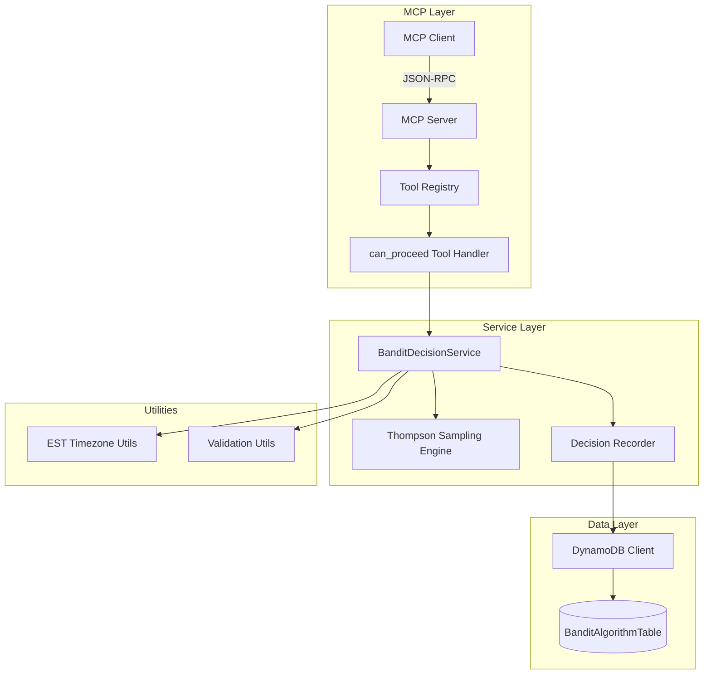

# Design Document: can_proceed() MCP Tool

## Overview

The `can_proceed()` MCP tool implements a Multi-Armed Bandit (MAB) algorithm using Thompson Sampling to intelligently control trade entry decisions. The tool evaluates whether a ticker should be allowed to enter a trade based on its intraday performance history, balancing exploration of new opportunities with exploitation of historically successful tickers.

The tool integrates with the existing MCP server infrastructure and uses the `BanditAlgorithmTable` in DynamoDB for persistence.

## Architecture



## Components and Interfaces

### 1. MCP Tool Handler (`can_proceed`)

Location: `app/src/services/mcp/tools.py`

```python
async def can_proceed(
    ticker: str,
    indicator: str,
    current_price: str,
    action: str,
    confidence_score: str
) -> dict[str, Any]:
    """
    Determine if a trade should proceed based on intraday performance.
    
    Args:
        ticker: Stock ticker symbol (e.g., "AAPL")
        indicator: Trading indicator name (e.g., "momentum")
        current_price: Current price as string (e.g., "150.25")
        action: Trade action - one of: buy_to_open, sell_to_open, 
                sell_to_close, buy_to_close
        confidence_score: Signal confidence between "0" and "1"
    
    Returns:
        Dict containing:
            - decision: bool - True if trade should proceed
            - ticker: str
            - indicator: str
            - action: str
            - reason: str - explanation of decision
            - intraday_stats: dict - current day's success/failure counts
    """
```

### 2. BanditDecisionService

Location: `app/src/services/bandit/bandit_decision_service.py`

This service encapsulates the bandit algorithm logic and decision recording.

```python
class BanditDecisionService:
    """Service for making bandit-based trade decisions."""
    
    BANDIT_TABLE = "BanditAlgorithmTable"
    
    @classmethod
    async def can_proceed(
        cls,
        ticker: str,
        indicator: str,
        current_price: float,
        action: str,
        confidence_score: float
    ) -> BanditDecision:
        """Make a decision and record it."""
    
    @classmethod
    def calculate_decision(
        cls,
        successes: int,
        failures: int,
        confidence_score: float,
        action: str
    ) -> tuple[bool, str]:
        """Pure function for decision calculation."""
    
    @classmethod
    def thompson_sample(cls, alpha: int, beta: int) -> float:
        """Sample from Beta distribution for Thompson Sampling."""
    
    @classmethod
    async def get_intraday_stats(
        cls,
        ticker: str,
        indicator: str
    ) -> IntradayStats:
        """Get current day's success/failure counts."""
    
    @classmethod
    async def record_decision(
        cls,
        ticker: str,
        indicator: str,
        action: str,
        current_price: float,
        confidence_score: float,
        decision: bool,
        reason: str,
        intraday_stats: IntradayStats
    ) -> bool:
        """Record the decision in DynamoDB."""
    
    @classmethod
    async def update_outcome(
        cls,
        ticker: str,
        indicator: str,
        success: bool
    ) -> bool:
        """Update the bandit state after trade completion."""
```

### 3. Data Models

Location: `app/src/models/bandit_models.py`

```python
from dataclasses import dataclass
from typing import Optional

@dataclass
class IntradayStats:
    """Statistics for a ticker's intraday performance."""
    ticker: str
    indicator: str
    date: str  # YYYY-MM-DD in EST
    successes: int
    failures: int
    total_decisions: int
    last_updated: str  # ISO timestamp in EST
    
    def to_dict(self) -> dict:
        """Convert to dictionary for DynamoDB."""
    
    @classmethod
    def from_dict(cls, data: dict) -> 'IntradayStats':
        """Create from DynamoDB item."""

@dataclass
class BanditDecision:
    """Result of a bandit decision."""
    decision: bool
    ticker: str
    indicator: str
    action: str
    reason: str
    intraday_stats: IntradayStats
    confidence_score: float
    current_price: float
    timestamp: str  # ISO timestamp in EST
    
    def to_response_dict(self) -> dict:
        """Convert to MCP response format."""
```

## Data Models

### BanditAlgorithmTable Schema

The table uses `ticker` as partition key and `indicator` as sort key.

| Attribute | Type | Description |
|-----------|------|-------------|
| ticker | String (PK) | Stock ticker symbol |
| indicator | String (SK) | Trading indicator name |
| date | String | Current date in EST (YYYY-MM-DD) |
| successes | Number | Count of successful trades today |
| failures | Number | Count of failed trades today |
| total_decisions | Number | Total decisions made today |
| last_decision | Boolean | Last decision made |
| last_decision_timestamp | String | ISO timestamp of last decision (EST) |
| last_confidence_score | Number | Confidence score of last decision |
| last_price | Number | Price at last decision |
| created_at | String | Record creation timestamp (EST) |
| updated_at | String | Last update timestamp (EST) |

### Decision Record Structure

Each decision is recorded with the following structure:

```json
{
  "ticker": "AAPL",
  "indicator": "momentum",
  "date": "2024-12-12",
  "successes": 3,
  "failures": 1,
  "total_decisions": 5,
  "last_decision": true,
  "last_decision_timestamp": "2024-12-12T10:30:00-05:00",
  "last_confidence_score": 0.85,
  "last_price": 150.25,
  "created_at": "2024-12-12T09:30:00-05:00",
  "updated_at": "2024-12-12T10:30:00-05:00"
}
```

## Correctness Properties

*A property is a characteristic or behavior that should hold true across all valid executions of a system-essentially, a formal statement about what the system should do. Properties serve as the bridge between human-readable specifications and machine-verifiable correctness guarantees.*

### Property 1: Return Type Consistency
*For any* valid input parameters (ticker, indicator, current_price, action, confidence_score), the `can_proceed` function SHALL return a result containing a boolean `decision` field.

**Validates: Requirements 1.1**

### Property 2: Exit Actions Always Proceed
*For any* ticker, indicator, price, and confidence_score combination, WHEN the action is "sell_to_close" or "buy_to_close", the decision SHALL be True.

**Validates: Requirements 1.3**

### Property 3: Success/Failure Ratio Monotonicity
*For any* two bandit states with the same total trades but different success/failure ratios, the state with the higher success ratio SHALL have a higher probability of returning True (over many samples).

**Validates: Requirements 2.1, 3.1, 3.2**

### Property 4: Neutral Prior for New Tickers
*For any* ticker with no intraday history (successes=0, failures=0), the Thompson Sampling SHALL use Beta(1, 1) parameters, resulting in a uniform distribution over [0, 1].

**Validates: Requirements 2.2**

### Property 5: Thompson Sampling Beta Parameters
*For any* intraday stats with `s` successes and `f` failures, the Thompson Sampling SHALL use Beta(1 + s, 1 + f) distribution parameters.

**Validates: Requirements 2.3**

### Property 6: Confidence Score Influence
*For any* two otherwise identical scenarios with different confidence scores, the scenario with the higher confidence score SHALL have a higher probability of returning True (over many samples).

**Validates: Requirements 3.3**

### Property 7: Decision Record Completeness
*For any* decision made by the tool, the stored record SHALL contain all required fields: ticker, indicator, action, current_price, confidence_score, decision, timestamp, successes, and failures.

**Validates: Requirements 4.1**

### Property 8: EST Timezone Consistency
*For any* timestamp stored in the BanditAlgorithmTable, the timestamp SHALL be in EST (America/New_York) timezone format.

**Validates: Requirements 4.2**

### Property 9: Intraday Data Filtering
*For any* query for intraday stats, the system SHALL only return data where the date matches the current EST date.

**Validates: Requirements 4.3**

### Property 10: Invalid Input Rejection
*For any* input where ticker is empty/invalid, indicator is empty, action is not in valid set, or confidence_score is outside [0, 1], the function SHALL raise a ValueError.

**Validates: Requirements 5.1, 5.2, 5.3, 5.4**

### Property 11: MCP Response Structure
*For any* successful call to the `can_proceed` MCP tool, the response SHALL contain a JSON object with `decision` (boolean) and `reason` (string) fields.

**Validates: Requirements 6.3**

### Property 12: Thompson Sampling Statistical Correctness
*For any* Beta(α, β) parameters, the Thompson Sampling function SHALL produce samples that, over many iterations, have a mean approaching α/(α+β).

**Validates: Requirements 7.1**

### Property 13: Bandit State Round-Trip
*For any* valid IntradayStats object, serializing to dict and deserializing back SHALL produce an equivalent object.

**Validates: Requirements 7.3**

## Error Handling

### Input Validation Errors

| Error Condition | Error Type | Message |
|-----------------|------------|---------|
| Empty/invalid ticker | ValueError | "Invalid ticker '{ticker}'. Please provide a valid stock ticker symbol." |
| Empty indicator | ValueError | "Invalid indicator. Indicator cannot be empty." |
| Invalid action | ValueError | "Invalid action '{action}'. Must be one of: buy_to_open, sell_to_open, sell_to_close, buy_to_close" |
| Invalid confidence_score | ValueError | "Invalid confidence_score '{score}'. Must be a number between 0 and 1." |
| Invalid current_price | ValueError | "Invalid current_price '{price}'. Must be a positive number." |

### DynamoDB Errors

The service implements a fail-open strategy for DynamoDB errors:

1. **Read Failures**: If unable to read intraday stats, assume neutral prior (successes=0, failures=0)
2. **Write Failures**: Log the error but still return the decision (don't block trades)
3. **Connection Errors**: Log and return True to avoid blocking trades

```python
try:
    stats = await cls.get_intraday_stats(ticker, indicator)
except Exception as e:
    logger.error(f"Failed to get intraday stats for {ticker}/{indicator}: {e}")
    stats = IntradayStats(ticker=ticker, indicator=indicator, date=today, 
                          successes=0, failures=0, total_decisions=0, 
                          last_updated=now)
```

## Testing Strategy

### Property-Based Testing Framework

The implementation will use **Hypothesis** for property-based testing, consistent with the existing test infrastructure in the project (as evidenced by the `.hypothesis` directory).

### Test Configuration

- Minimum 100 iterations per property test
- Use `@settings(max_examples=100)` decorator
- Tag each test with the property it validates

### Unit Tests

1. **Input Validation Tests**
   - Test empty ticker rejection
   - Test empty indicator rejection
   - Test invalid action rejection
   - Test out-of-range confidence_score rejection

2. **Exit Action Tests**
   - Test sell_to_close always returns True
   - Test buy_to_close always returns True

3. **Integration Tests**
   - Test full flow with mocked DynamoDB
   - Test MCP tool registration and invocation

### Property-Based Tests

Each correctness property will have a corresponding property-based test:

```python
from hypothesis import given, strategies as st, settings

@settings(max_examples=100)
@given(
    successes=st.integers(min_value=0, max_value=100),
    failures=st.integers(min_value=0, max_value=100)
)
def test_thompson_sampling_beta_parameters(successes: int, failures: int):
    """
    **Feature: can-proceed-bandit-tool, Property 5: Thompson Sampling Beta Parameters**
    
    For any intraday stats with s successes and f failures,
    the Thompson Sampling SHALL use Beta(1 + s, 1 + f) distribution parameters.
    """
    # Test implementation
```

### Test File Structure

```
tests/
├── property/
│   └── test_bandit_decision_properties.py  # Property-based tests
├── test_bandit_decision_service.py         # Unit tests
└── test_can_proceed_tool.py                # Integration tests
```
