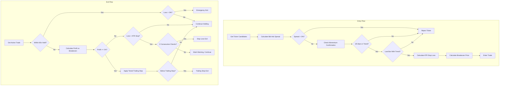

# Design Document: Penny Stock Algorithm Fix

## Overview

This design addresses the critical issues in the Penny Stocks trading algorithm that cause consistent losses. The current implementation has three fundamental flaws:

1. **Immediate loss exit** - Exits any trade the moment current price drops below entry price, ignoring bid-ask spread
2. **No breathing room** - 15-second minimum hold time and 0.5% trailing stop are too tight for volatile penny stocks
3. **No spread accounting** - Entry at ask, exit at bid means trades start at a loss equal to the spread

The solution implements:
- Breakeven calculation that accounts for bid-ask spread
- Volatility-based (ATR) stop losses with sensible bounds
- Tiered trailing stops that tighten as profit grows
- Longer minimum holding period with graduated exit rules
- Better entry confirmation requiring momentum continuation

## Architecture



## Components and Interfaces

### 1. SpreadCalculator

Calculates bid-ask spread and breakeven price.

```python
class SpreadCalculator:
    @staticmethod
    def calculate_spread_percent(bid: float, ask: float) -> float:
        """Calculate bid-ask spread as percentage of mid price"""
        if bid <= 0 or ask <= 0:
            return float('inf')
        mid = (bid + ask) / 2
        return ((ask - bid) / mid) * 100
    
    @staticmethod
    def calculate_breakeven_price(entry_price: float, spread_percent: float, is_long: bool) -> float:
        """
        Calculate breakeven price accounting for spread.
        For longs: need price to rise by spread to break even
        For shorts: need price to fall by spread to break even
        """
        spread_buffer = entry_price * (spread_percent / 100)
        if is_long:
            return entry_price + spread_buffer
        else:
            return entry_price - spread_buffer
```

### 2. ATRCalculator

Calculates Average True Range for volatility-based stops.

```python
class ATRCalculator:
    @staticmethod
    def calculate_atr(bars: List[Dict[str, Any]], period: int = 14) -> Optional[float]:
        """
        Calculate ATR from price bars.
        Returns None if insufficient data.
        """
        if len(bars) < period + 1:
            return None
        
        true_ranges = []
        for i in range(1, len(bars)):
            high = bars[i].get('h', 0)
            low = bars[i].get('l', 0)
            prev_close = bars[i-1].get('c', 0)
            
            tr = max(
                high - low,
                abs(high - prev_close),
                abs(low - prev_close)
            )
            true_ranges.append(tr)
        
        # Use last 'period' true ranges
        recent_tr = true_ranges[-period:]
        return sum(recent_tr) / len(recent_tr)
    
    @staticmethod
    def calculate_stop_loss_percent(atr: float, current_price: float, 
                                     multiplier: float = 1.5,
                                     min_stop: float = -1.5,
                                     max_stop: float = -4.0) -> float:
        """
        Calculate stop loss as percentage based on ATR.
        Returns negative percentage (e.g., -2.5 for 2.5% stop).
        """
        if current_price <= 0:
            return -2.0  # Default
        
        atr_percent = (atr / current_price) * 100 * multiplier
        stop_percent = -atr_percent
        
        # Clamp to bounds
        return max(max_stop, min(min_stop, stop_percent))
```

### 3. TieredTrailingStop

Manages tiered trailing stop logic.

```python
@dataclass
class TrailingStopConfig:
    profit_threshold: float  # Profit % to activate this tier
    trail_percent: float     # Trail distance below peak
    min_locked_profit: float # Minimum profit to lock (0 if not applicable)

class TieredTrailingStop:
    TIERS = [
        TrailingStopConfig(profit_threshold=3.0, trail_percent=1.5, min_locked_profit=1.5),
        TrailingStopConfig(profit_threshold=2.0, trail_percent=0.3, min_locked_profit=0.0),
        TrailingStopConfig(profit_threshold=1.0, trail_percent=0.5, min_locked_profit=0.0),
    ]
    
    @classmethod
    def get_trailing_stop_price(cls, peak_price: float, current_profit_percent: float,
                                 entry_price: float, is_long: bool) -> Optional[float]:
        """
        Calculate trailing stop price based on current profit tier.
        Returns None if no trailing stop should be active.
        """
        for tier in cls.TIERS:
            if current_profit_percent >= tier.profit_threshold:
                trail_amount = peak_price * (tier.trail_percent / 100)
                
                if is_long:
                    stop_price = peak_price - trail_amount
                    # Ensure minimum locked profit
                    if tier.min_locked_profit > 0:
                        min_stop = entry_price * (1 + tier.min_locked_profit / 100)
                        stop_price = max(stop_price, min_stop)
                else:
                    stop_price = peak_price + trail_amount
                    if tier.min_locked_profit > 0:
                        min_stop = entry_price * (1 - tier.min_locked_profit / 100)
                        stop_price = min(stop_price, min_stop)
                
                return stop_price
        
        return None  # No trailing stop active yet
```

### 4. ExitDecisionEngine

Centralized exit decision logic.

```python
@dataclass
class ExitDecision:
    should_exit: bool
    reason: str
    exit_type: str  # 'emergency', 'stop_loss', 'trailing_stop', 'profit_target'
    is_spread_induced: bool = False

class ExitDecisionEngine:
    MIN_HOLDING_SECONDS = 60
    EMERGENCY_STOP_PERCENT = -3.0
    CONSECUTIVE_CHECKS_REQUIRED = 2
    
    def __init__(self):
        self.consecutive_loss_checks: Dict[str, int] = {}
    
    def evaluate_exit(self, 
                      ticker: str,
                      entry_price: float,
                      breakeven_price: float,
                      current_price: float,
                      peak_price: float,
                      atr_stop_percent: float,
                      holding_seconds: float,
                      is_long: bool,
                      spread_percent: float) -> ExitDecision:
        """
        Evaluate whether trade should exit and why.
        """
        profit_vs_entry = self._calc_profit(entry_price, current_price, is_long)
        profit_vs_breakeven = self._calc_profit(breakeven_price, current_price, is_long)
        
        # PRIORITY 1: Emergency exit on significant loss (always active)
        if profit_vs_entry <= self.EMERGENCY_STOP_PERCENT:
            is_spread_induced = abs(profit_vs_entry) <= spread_percent * 1.5
            return ExitDecision(
                should_exit=True,
                reason=f"Emergency stop: {profit_vs_entry:.2f}% loss",
                exit_type='emergency',
                is_spread_induced=is_spread_induced
            )
        
        # Within minimum holding period - only emergency exits
        if holding_seconds < self.MIN_HOLDING_SECONDS:
            return ExitDecision(
                should_exit=False,
                reason=f"Within holding period ({holding_seconds:.0f}s < {self.MIN_HOLDING_SECONDS}s)",
                exit_type='none'
            )
        
        # PRIORITY 2: Trailing stop (if in profit)
        if profit_vs_breakeven >= 1.0:
            trailing_stop_price = TieredTrailingStop.get_trailing_stop_price(
                peak_price, profit_vs_breakeven, breakeven_price, is_long
            )
            if trailing_stop_price:
                triggered = (current_price <= trailing_stop_price) if is_long else (current_price >= trailing_stop_price)
                if triggered:
                    return ExitDecision(
                        should_exit=True,
                        reason=f"Trailing stop triggered at ${trailing_stop_price:.4f}",
                        exit_type='trailing_stop'
                    )
        
        # PRIORITY 3: ATR-based stop loss (requires consecutive checks)
        if profit_vs_breakeven <= atr_stop_percent:
            self.consecutive_loss_checks[ticker] = self.consecutive_loss_checks.get(ticker, 0) + 1
            
            if self.consecutive_loss_checks[ticker] >= self.CONSECUTIVE_CHECKS_REQUIRED:
                is_spread_induced = abs(profit_vs_entry) <= spread_percent * 1.5
                self.consecutive_loss_checks[ticker] = 0
                return ExitDecision(
                    should_exit=True,
                    reason=f"ATR stop loss: {profit_vs_breakeven:.2f}% (threshold: {atr_stop_percent:.2f}%)",
                    exit_type='stop_loss',
                    is_spread_induced=is_spread_induced
                )
            else:
                return ExitDecision(
                    should_exit=False,
                    reason=f"Loss warning {self.consecutive_loss_checks[ticker]}/{self.CONSECUTIVE_CHECKS_REQUIRED}",
                    exit_type='none'
                )
        else:
            # Reset consecutive loss counter if not in loss
            self.consecutive_loss_checks[ticker] = 0
        
        return ExitDecision(
            should_exit=False,
            reason=f"Holding: profit {profit_vs_breakeven:.2f}%",
            exit_type='none'
        )
    
    def _calc_profit(self, base_price: float, current_price: float, is_long: bool) -> float:
        if base_price <= 0:
            return 0.0
        if is_long:
            return ((current_price - base_price) / base_price) * 100
        else:
            return ((base_price - current_price) / base_price) * 100
```

### 5. MomentumConfirmation

Validates entry momentum.

```python
class MomentumConfirmation:
    MIN_BARS_IN_TREND = 3
    TOTAL_BARS_TO_CHECK = 5
    
    @classmethod
    def is_momentum_confirmed(cls, bars: List[Dict[str, Any]], is_long: bool) -> Tuple[bool, str]:
        """
        Check if momentum is confirmed for entry.
        Returns (is_confirmed, reason)
        """
        if len(bars) < cls.TOTAL_BARS_TO_CHECK:
            return False, f"Insufficient bars: {len(bars)} < {cls.TOTAL_BARS_TO_CHECK}"
        
        recent_bars = bars[-cls.TOTAL_BARS_TO_CHECK:]
        
        # Count bars moving in trend direction
        bars_in_trend = 0
        for i in range(1, len(recent_bars)):
            prev_close = recent_bars[i-1].get('c', 0)
            curr_close = recent_bars[i].get('c', 0)
            
            if is_long and curr_close > prev_close:
                bars_in_trend += 1
            elif not is_long and curr_close < prev_close:
                bars_in_trend += 1
        
        # Check if last bar is with trend
        last_bar_close = recent_bars[-1].get('c', 0)
        second_last_close = recent_bars[-2].get('c', 0)
        
        last_bar_with_trend = (
            (is_long and last_bar_close > second_last_close) or
            (not is_long and last_bar_close < second_last_close)
        )
        
        if bars_in_trend < cls.MIN_BARS_IN_TREND:
            return False, f"Only {bars_in_trend}/{cls.MIN_BARS_IN_TREND} bars in trend direction"
        
        if not last_bar_with_trend:
            return False, "Last bar moves against trend"
        
        return True, f"Confirmed: {bars_in_trend}/{cls.TOTAL_BARS_TO_CHECK - 1} bars in trend, last bar confirms"
```

## Data Models

### TradeState (Extended)

```python
@dataclass
class PennyStockTradeState:
    ticker: str
    action: str  # 'buy_to_open' or 'sell_to_open'
    entry_price: float
    breakeven_price: float
    spread_at_entry: float
    atr_stop_percent: float
    peak_price: float
    peak_profit_percent: float
    created_at: datetime
    consecutive_loss_checks: int = 0
```

### PerformanceMetrics

```python
@dataclass
class DailyPerformanceMetrics:
    total_trades: int = 0
    winning_trades: int = 0
    losing_trades: int = 0
    total_profit: float = 0.0
    total_loss: float = 0.0
    spread_induced_losses: int = 0
    
    @property
    def win_rate(self) -> float:
        if self.total_trades == 0:
            return 0.0
        return (self.winning_trades / self.total_trades) * 100
    
    @property
    def average_win(self) -> float:
        if self.winning_trades == 0:
            return 0.0
        return self.total_profit / self.winning_trades
    
    @property
    def average_loss(self) -> float:
        if self.losing_trades == 0:
            return 0.0
        return self.total_loss / self.losing_trades
    
    @property
    def profit_factor(self) -> float:
        if self.total_loss == 0:
            return float('inf') if self.total_profit > 0 else 0.0
        return abs(self.total_profit / self.total_loss)
```

## Correctness Properties

*A property is a characteristic or behavior that should hold true across all valid executions of a system-essentially, a formal statement about what the system should do. Properties serve as the bridge between human-readable specifications and machine-verifiable correctness guarantees.*

### Property 1: Breakeven Calculation Accounts for Spread

*For any* entry price and bid-ask spread, the breakeven price for a long trade should equal entry price plus the spread buffer, and for a short trade should equal entry price minus the spread buffer.

**Validates: Requirements 1.1, 1.2**

### Property 2: High Spread Rejection

*For any* ticker with bid-ask spread exceeding 3%, the ticker should be rejected for entry.

**Validates: Requirements 1.3**

### Property 3: Holding Period Exit Restrictions

*For any* trade within the 60-second minimum holding period, the only exit condition that should trigger is emergency stop (loss > 3%). Profit-taking and regular stop losses should not trigger exits during this period.

**Validates: Requirements 2.1, 5.1, 5.2, 5.3**

### Property 4: Pre-Breakeven Stop Loss

*For any* trade that has not reached breakeven, the stop loss should be -2% from breakeven (not immediate exit on any loss).

**Validates: Requirements 2.2**

### Property 5: Consecutive Check Requirement

*For any* stop loss condition, the loss must persist for at least 2 consecutive price checks before triggering an exit.

**Validates: Requirements 2.3**

### Property 6: Tiered Trailing Stop Progression

*For any* trade, the trailing stop should follow the tiered progression:
- At 1% profit: trail at 0.5% below peak
- At 2% profit: trail at 0.3% below peak  
- At 3% profit: lock in minimum 1.5% profit

**Validates: Requirements 3.1, 3.2, 3.3, 3.4**

### Property 7: ATR-Based Stop Loss Bounds

*For any* trade entry, the initial stop loss should equal 1.5x ATR as a percentage, clamped between -1.5% and -4%. When ATR cannot be calculated, default to -2%.

**Validates: Requirements 4.1, 4.2, 4.3**

### Property 8: Momentum Confirmation for Entry

*For any* entry attempt, the trade should only be entered if at least 3 of the last 5 bars move in the trend direction AND the most recent bar confirms the trend.

**Validates: Requirements 6.1, 6.2**

### Property 9: Performance Metrics Calculation

*For any* set of completed trades, the win rate, average win, average loss, and profit factor should be correctly calculated from the trade outcomes.

**Validates: Requirements 7.2**

### Property 10: Loss Classification

*For any* stopped-out trade, the loss should be correctly classified as spread-induced (if loss <= 1.5x spread) or genuine price movement (if loss > 1.5x spread).

**Validates: Requirements 7.3**

## Error Handling

1. **Invalid Price Data**: If bid/ask prices are zero or negative, reject the ticker
2. **Insufficient Bars**: If fewer than 5 bars available, skip entry evaluation
3. **ATR Calculation Failure**: Fall back to default -2% stop loss
4. **Quote Fetch Failure**: Retry once, then skip to next cycle
5. **Database Write Failure**: Log error and continue (don't block trading)

## Testing Strategy

### Property-Based Testing

Use **Hypothesis** (Python PBT library) for property-based tests. Each correctness property will have a corresponding property test.

**Test Configuration:**
- Minimum 100 iterations per property test
- Use composite strategies for generating realistic trade scenarios
- Tag each test with the property it validates

**Generator Strategies:**
```python
# Price generator for penny stocks
penny_stock_price = st.floats(min_value=0.01, max_value=5.0, allow_nan=False)

# Spread generator (realistic spreads)
spread_percent = st.floats(min_value=0.1, max_value=10.0, allow_nan=False)

# Bar data generator
@st.composite
def price_bar(draw):
    open_price = draw(penny_stock_price)
    variance = draw(st.floats(min_value=0.01, max_value=0.1))
    return {
        'o': open_price,
        'h': open_price * (1 + variance),
        'l': open_price * (1 - variance),
        'c': draw(st.floats(min_value=open_price * 0.9, max_value=open_price * 1.1)),
        'v': draw(st.integers(min_value=100, max_value=100000))
    }
```

### Unit Tests

- Test edge cases for each calculator (zero prices, extreme values)
- Test tier boundary conditions for trailing stops
- Test holding period boundary (exactly 60 seconds)

### Integration Tests

- Test full entry flow with mocked market data
- Test full exit flow with various profit/loss scenarios
- Test consecutive check counter persistence
