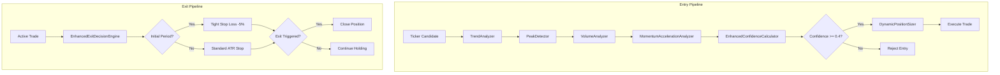

# Design Document: Penny Stock Peak Detection

## Overview

This design introduces peak detection and enhanced validation to the penny stocks trading algorithm to prevent entering trades at local price peaks. The solution adds four new components that integrate with the existing `PennyStocksIndicator` and `TrendAnalyzer`:

1. **PeakDetector** - Identifies when price is at or near a local maximum
2. **VolumeAnalyzer** - Confirms price movements are supported by volume
3. **MomentumAccelerationAnalyzer** - Detects momentum deceleration before entry
4. **EnhancedConfidenceCalculator** - Combines all factors into a predictive confidence score

The existing `ExitDecisionEngine` is extended with tighter initial stop losses, and a new `DynamicPositionSizer` handles position sizing based on confidence.

## Architecture



## Components and Interfaces

### PeakDetector

Identifies when price is at or near a local peak within a configurable lookback window.

**Interface**:
```python
@dataclass
class PeakDetectionResult:
    peak_proximity_score: float  # 0.0-1.0, 1.0 = at peak
    peak_price: float
    current_price: float
    lookback_bars: int
    is_at_peak: bool  # True if score > threshold

class PeakDetector:
    DEFAULT_LOOKBACK_BARS: int = 10
    DEFAULT_PEAK_THRESHOLD: float = 0.85
    
    @classmethod
    def detect_peak(
        cls,
        bars: List[Dict[str, Any]],
        current_price: float,
        lookback_bars: int = DEFAULT_LOOKBACK_BARS,
        peak_threshold: float = DEFAULT_PEAK_THRESHOLD
    ) -> PeakDetectionResult:
        """
        Calculate peak proximity score.
        
        Algorithm:
        1. Extract high prices from last `lookback_bars` bars
        2. Find peak_price = max(high prices)
        3. Calculate distance_from_peak = (peak_price - current_price) / peak_price
        4. peak_proximity_score = 1.0 - (distance_from_peak / 0.03)  # Normalize to 3% range
        5. Clamp score to [0.0, 1.0]
        
        Returns PeakDetectionResult with score and metadata.
        """
        pass
```

### VolumeAnalyzer

Confirms that price movements are supported by adequate volume.

**Interface**:
```python
@dataclass
class VolumeConfirmationResult:
    volume_confirmation_score: float  # 0.0-1.0
    current_volume: int
    average_volume: float
    volume_ratio: float  # current / average

class VolumeAnalyzer:
    DEFAULT_LOOKBACK_BARS: int = 20
    HIGH_VOLUME_MULTIPLIER: float = 1.5  # 50% above average = score 1.0
    
    @classmethod
    def analyze_volume(
        cls,
        bars: List[Dict[str, Any]],
        lookback_bars: int = DEFAULT_LOOKBACK_BARS
    ) -> VolumeConfirmationResult:
        """
        Calculate volume confirmation score.
        
        Algorithm:
        1. Extract volumes from last `lookback_bars` bars
        2. Calculate average_volume = mean(volumes[:-1])  # Exclude current bar
        3. current_volume = volumes[-1]
        4. volume_ratio = current_volume / average_volume
        5. If volume_ratio >= 1.5: score = 1.0
        6. Else: score = volume_ratio / 1.5  # Linear scale
        7. Clamp score to [0.0, 1.0]
        
        Returns VolumeConfirmationResult with score and metadata.
        """
        pass
```

### MomentumAccelerationAnalyzer

Detects whether momentum is accelerating or decelerating.

**Interface**:
```python
@dataclass
class MomentumAccelerationResult:
    acceleration: float  # Raw acceleration value
    normalized_acceleration: float  # -1.0 to 1.0
    is_decelerating: bool
    momentum_values: List[float]  # Last 3 momentum values

class MomentumAccelerationAnalyzer:
    DECELERATION_THRESHOLD: float = -2.0
    NORMALIZATION_RANGE: float = 5.0  # Values beyond ±5 are clamped
    
    @classmethod
    def analyze_acceleration(
        cls,
        bars: List[Dict[str, Any]],
        deceleration_threshold: float = DECELERATION_THRESHOLD
    ) -> MomentumAccelerationResult:
        """
        Calculate momentum acceleration.
        
        Algorithm:
        1. Calculate momentum for each of last 4 bars: momentum[i] = (close[i] - close[i-1]) / close[i-1] * 100
        2. Calculate acceleration: accel = momentum[-1] - momentum[-2]
        3. normalized_acceleration = clamp(accel / NORMALIZATION_RANGE, -1.0, 1.0)
        4. is_decelerating = accel < deceleration_threshold
        
        Returns MomentumAccelerationResult with acceleration and metadata.
        """
        pass
```

### EnhancedConfidenceCalculator

Combines all validation factors into a single predictive confidence score.

**Interface**:
```python
@dataclass
class ConfidenceComponents:
    momentum_score: float
    peak_proximity_score: float
    volume_confirmation_score: float
    momentum_acceleration_score: float
    
    def to_dict(self) -> Dict[str, float]:
        """Convert to dictionary for JSON serialization."""
        pass

@dataclass
class EnhancedConfidenceResult:
    confidence_score: float  # 0.0-1.0
    components: ConfidenceComponents
    rejection_reason: Optional[str]  # Set if confidence too low

class EnhancedConfidenceCalculator:
    # Weights for each component (must sum to 1.0)
    MOMENTUM_WEIGHT: float = 0.25
    PEAK_PROXIMITY_WEIGHT: float = 0.25
    VOLUME_WEIGHT: float = 0.25
    ACCELERATION_WEIGHT: float = 0.25
    
    MIN_CONFIDENCE_THRESHOLD: float = 0.4
    
    @classmethod
    def calculate_confidence(
        cls,
        momentum_score: float,
        peak_proximity_score: float,
        volume_confirmation_score: float,
        momentum_acceleration: float
    ) -> EnhancedConfidenceResult:
        """
        Calculate enhanced confidence score.
        
        Algorithm:
        1. Normalize momentum_score to 0-1 range (5% to 20% -> 0 to 1)
        2. Invert peak_proximity: peak_factor = 1.0 - peak_proximity_score
        3. volume_factor = volume_confirmation_score (already 0-1)
        4. acceleration_factor = (momentum_acceleration + 1.0) / 2.0  # -1 to 1 -> 0 to 1
        5. confidence = weighted sum of all factors
        6. If confidence < MIN_CONFIDENCE_THRESHOLD: set rejection_reason
        
        Returns EnhancedConfidenceResult with score and components.
        """
        pass
```

### EnhancedExitDecisionEngine

Extends the existing `ExitDecisionEngine` with tighter initial stop losses.

**Interface**:
```python
class EnhancedExitDecisionEngine(ExitDecisionEngine):
    # Initial period configuration
    INITIAL_PERIOD_SECONDS: int = 180  # 3 minutes
    INITIAL_STOP_LOSS_PERCENT: float = -5.0
    EARLY_EXIT_LOSS_PERCENT: float = -3.0
    EARLY_EXIT_TIME_SECONDS: int = 120  # 2 minutes
    
    def evaluate_exit(
        self,
        ticker: str,
        entry_price: float,
        breakeven_price: float,
        current_price: float,
        peak_price: float,
        atr_stop_percent: float,
        holding_seconds: float,
        is_long: bool,
        spread_percent: float,
        recent_bars: Optional[List[Dict[str, Any]]] = None
    ) -> ExitDecision:
        """
        Enhanced exit evaluation with tighter initial stops.
        
        Priority order:
        1. Emergency exit on -8% loss (always active)
        2. Early exit: -3% loss within first 2 minutes
        3. Initial period stop: -5% loss within first 3 minutes
        4. Standard ATR-based stop (after initial period)
        5. Trailing stop for profitable trades
        6. Trend reversal detection
        
        Returns ExitDecision with should_exit, reason, and exit_type.
        """
        pass
```

### DynamicPositionSizer

Calculates position size based on confidence score.

**Interface**:
```python
@dataclass
class PositionSizeResult:
    position_size_dollars: float
    position_size_percent: float  # Percentage of standard size
    confidence_score: float
    reason: str

class DynamicPositionSizer:
    MIN_POSITION_SIZE: float = 50.0  # Minimum $50 position
    
    # Confidence tiers
    HIGH_CONFIDENCE_THRESHOLD: float = 0.8
    MEDIUM_CONFIDENCE_THRESHOLD: float = 0.6
    LOW_CONFIDENCE_THRESHOLD: float = 0.4
    
    # Position size multipliers
    HIGH_CONFIDENCE_MULTIPLIER: float = 1.0  # 100%
    MEDIUM_CONFIDENCE_MULTIPLIER: float = 0.75  # 75%
    LOW_CONFIDENCE_MULTIPLIER: float = 0.5  # 50%
    
    @classmethod
    def calculate_position_size(
        cls,
        standard_position_size: float,
        confidence_score: float
    ) -> PositionSizeResult:
        """
        Calculate position size based on confidence.
        
        Algorithm:
        1. If confidence >= 0.8: multiplier = 1.0
        2. Elif confidence >= 0.6: multiplier = 0.75
        3. Elif confidence >= 0.4: multiplier = 0.5
        4. Else: reject (handled by confidence calculator)
        5. position_size = max(standard_size * multiplier, MIN_POSITION_SIZE)
        
        Returns PositionSizeResult with size and metadata.
        """
        pass
```

## Data Models

### Configuration Model

```python
@dataclass
class PeakDetectionConfig:
    """Configuration for peak detection and enhanced validation."""
    
    # Peak detection
    peak_proximity_threshold: float = 0.85
    peak_lookback_bars: int = 10
    
    # Volume confirmation
    volume_lookback_bars: int = 20
    high_volume_multiplier: float = 1.5
    
    # Momentum acceleration
    momentum_deceleration_threshold: float = -2.0
    
    # Stop losses
    initial_stop_loss_percent: float = -5.0
    early_exit_loss_percent: float = -3.0
    early_exit_time_seconds: int = 120
    initial_period_seconds: int = 180
    
    # Position sizing
    min_confidence_threshold: float = 0.4
    min_position_size: float = 50.0
    
    def to_dict(self) -> Dict[str, Any]:
        """Convert to dictionary for serialization."""
        return {
            "peak_proximity_threshold": self.peak_proximity_threshold,
            "peak_lookback_bars": self.peak_lookback_bars,
            "volume_lookback_bars": self.volume_lookback_bars,
            "high_volume_multiplier": self.high_volume_multiplier,
            "momentum_deceleration_threshold": self.momentum_deceleration_threshold,
            "initial_stop_loss_percent": self.initial_stop_loss_percent,
            "early_exit_loss_percent": self.early_exit_loss_percent,
            "early_exit_time_seconds": self.early_exit_time_seconds,
            "initial_period_seconds": self.initial_period_seconds,
            "min_confidence_threshold": self.min_confidence_threshold,
            "min_position_size": self.min_position_size,
        }
    
    @classmethod
    def from_dict(cls, data: Dict[str, Any]) -> "PeakDetectionConfig":
        """Create from dictionary (JSON deserialization)."""
        return cls(**data)
```

### Validation Result Model

```python
@dataclass
class ValidationResult:
    """Complete validation result for a ticker."""
    
    ticker: str
    timestamp: str
    passed: bool
    rejection_reason: Optional[str]
    
    # Component results
    peak_detection: Optional[PeakDetectionResult]
    volume_confirmation: Optional[VolumeConfirmationResult]
    momentum_acceleration: Optional[MomentumAccelerationResult]
    confidence: Optional[EnhancedConfidenceResult]
    position_size: Optional[PositionSizeResult]
    
    def to_json(self) -> str:
        """Serialize to JSON for logging."""
        pass
    
    @classmethod
    def from_json(cls, json_str: str) -> "ValidationResult":
        """Deserialize from JSON."""
        pass
```


## Correctness Properties

*A property is a characteristic or behavior that should hold true across all valid executions of a system—essentially, a formal statement about what the system should do. Properties serve as the bridge between human-readable specifications and machine-verifiable correctness guarantees.*

### Property 1: Peak Proximity Score Range Invariant

*For any* valid bars data and current price, the `PeakDetector.detect_peak()` method SHALL return a `peak_proximity_score` in the range [0.0, 1.0].

**Validates: Requirements 1.1**

### Property 2: Peak Proximity Below Threshold When Far From Peak

*For any* bars data where the current price is more than 3% below the peak price in the lookback window, the `PeakDetector.detect_peak()` method SHALL return a `peak_proximity_score` less than 0.5.

**Validates: Requirements 1.3**

### Property 3: Peak Rejection Threshold

*For any* `peak_proximity_score` greater than 0.85, the validation pipeline SHALL reject the entry with a reason containing "peak".

**Validates: Requirements 1.4**

### Property 4: Confidence Factor Monotonicity

*For any* two confidence calculations with identical inputs except for one factor:
- If `peak_proximity_score` increases (all else equal), confidence SHALL decrease
- If `volume_confirmation_score` increases (all else equal), confidence SHALL increase
- If `momentum_acceleration` increases (all else equal), confidence SHALL increase

**Validates: Requirements 2.1, 2.2, 2.3**

### Property 5: Confidence Score Range Invariant

*For any* valid inputs to `EnhancedConfidenceCalculator.calculate_confidence()`, the output `confidence_score` SHALL be in the range [0.0, 1.0].

**Validates: Requirements 2.5**

### Property 6: Volume Confirmation Score Range Invariant

*For any* valid bars data, the `VolumeAnalyzer.analyze_volume()` method SHALL return a `volume_confirmation_score` in the range [0.0, 1.0].

**Validates: Requirements 3.1**

### Property 7: High Volume Score Maximum

*For any* bars data where the current volume is at least 1.5x the average volume of the lookback period, the `VolumeAnalyzer.analyze_volume()` method SHALL return a `volume_confirmation_score` of 1.0.

**Validates: Requirements 3.2**

### Property 8: Volume Score Proportionality

*For any* bars data where the current volume is below the average volume, the `volume_confirmation_score` SHALL be proportional to the ratio of current volume to average volume (specifically: `score = volume_ratio / 1.5` where `volume_ratio = current / average`).

**Validates: Requirements 3.3**

### Property 9: Momentum Acceleration Sign Correctness

*For any* sequence of price bars:
- If the momentum of the most recent bar is greater than the momentum of the previous bar, the `acceleration` SHALL be positive
- If the momentum of the most recent bar is less than the momentum of the previous bar, the `acceleration` SHALL be negative

**Validates: Requirements 4.2, 4.3**

### Property 10: Normalized Acceleration Range Invariant

*For any* valid bars data, the `MomentumAccelerationAnalyzer.analyze_acceleration()` method SHALL return a `normalized_acceleration` in the range [-1.0, 1.0].

**Validates: Requirements 4.5**

### Property 11: Deceleration Rejection Threshold

*For any* `momentum_acceleration` value below -2.0, the validation pipeline SHALL reject the entry with a reason containing "decelerat".

**Validates: Requirements 4.4**

### Property 12: Initial Period Tight Stop Loss

*For any* trade held for less than 180 seconds (3 minutes), the `EnhancedExitDecisionEngine` SHALL use a stop loss threshold of -5.0% (not the standard ATR-based stop).

**Validates: Requirements 5.1**

### Property 13: ATR Stop Transition

*For any* trade held for 180 seconds or more, the `EnhancedExitDecisionEngine` SHALL use the ATR-based stop loss (not the initial tight stop).

**Validates: Requirements 5.2**

### Property 14: Early Exit on Quick Loss

*For any* trade with a loss exceeding 3% AND held for less than 120 seconds (2 minutes), the `EnhancedExitDecisionEngine` SHALL trigger an exit with `exit_type` of 'early_exit'.

**Validates: Requirements 5.3**

### Property 15: Emergency Exit During Initial Period

*For any* trade with a loss exceeding 5% AND held for less than 180 seconds (3 minutes), the `EnhancedExitDecisionEngine` SHALL trigger an exit with `exit_type` of 'emergency'.

**Validates: Requirements 5.4**

### Property 16: Position Sizing Tier Correctness

*For any* confidence score and standard position size:
- If confidence >= 0.8: position_size_percent SHALL be 1.0 (100%)
- If 0.6 <= confidence < 0.8: position_size_percent SHALL be 0.75 (75%)
- If 0.4 <= confidence < 0.6: position_size_percent SHALL be 0.5 (50%)

**Validates: Requirements 6.1, 6.2, 6.3**

### Property 17: Low Confidence Rejection

*For any* confidence score below 0.4, the validation pipeline SHALL reject the entry.

**Validates: Requirements 6.4**

### Property 18: Minimum Position Size Invariant

*For any* valid position size calculation that is not rejected, the `position_size_dollars` SHALL be at least $50.

**Validates: Requirements 6.5**

### Property 19: ValidationResult JSON Round-Trip

*For any* valid `ValidationResult` object, serializing to JSON via `to_json()` and then deserializing via `from_json()` SHALL produce an equivalent object.

**Validates: Requirements 2.6, 7.5**

## Error Handling

### Input Validation Errors

| Error Condition | Handling Strategy |
|----------------|-------------------|
| Empty bars list | Return neutral scores (0.5) and log warning |
| Insufficient bars (< 3) | Return neutral scores and log warning |
| Missing price data in bars | Skip invalid bars, use available data |
| Zero or negative prices | Treat as invalid, skip bar |
| Zero or negative volume | Use volume = 0 for calculations |

### Calculation Errors

| Error Condition | Handling Strategy |
|----------------|-------------------|
| Division by zero (avg volume = 0) | Return neutral score (0.5) |
| NaN/Inf results | Clamp to valid range, log warning |
| Overflow in calculations | Use Python's arbitrary precision, clamp results |

### Integration Errors

| Error Condition | Handling Strategy |
|----------------|-------------------|
| API timeout fetching bars | Use cached data if available, else skip ticker |
| Database write failure | Log error, continue processing (non-blocking) |
| Configuration parse error | Use default values, log warning |

## Testing Strategy

### Unit Tests

Unit tests verify specific examples and edge cases:

1. **PeakDetector edge cases**:
   - Current price equals peak price → score = 1.0
   - Current price at bottom → score near 0.0
   - Empty bars list → neutral score

2. **VolumeAnalyzer edge cases**:
   - No volume data → score = 0.5
   - Zero average volume → score = 0.5
   - Exactly 1.5x volume → score = 1.0

3. **MomentumAccelerationAnalyzer edge cases**:
   - Flat momentum (no change) → acceleration = 0
   - Extreme acceleration values → clamped to [-1, 1]

4. **EnhancedExitDecisionEngine edge cases**:
   - Exactly at 3-minute boundary
   - Exactly at -3% and -5% loss thresholds

### Property-Based Tests

Property-based tests verify universal properties across randomly generated inputs. Each test runs minimum 100 iterations.

**Testing Framework**: `hypothesis` (Python property-based testing library)

**Test Configuration**:
```python
from hypothesis import given, settings, strategies as st

@settings(max_examples=100)
```

**Property Test Tags**: Each test is tagged with:
- Feature: penny-stock-peak-detection
- Property number and title
- Requirements reference

Example:
```python
# Feature: penny-stock-peak-detection, Property 1: Peak Proximity Score Range Invariant
# Validates: Requirements 1.1
@given(bars=valid_bars_strategy(), current_price=st.floats(min_value=0.01, max_value=100.0))
@settings(max_examples=100)
def test_peak_proximity_score_range(bars, current_price):
    result = PeakDetector.detect_peak(bars, current_price)
    assert 0.0 <= result.peak_proximity_score <= 1.0
```

### Test Data Generators

Custom Hypothesis strategies for generating valid test data:

```python
@st.composite
def valid_bars_strategy(draw, min_bars=5, max_bars=50):
    """Generate valid price bars with realistic data."""
    num_bars = draw(st.integers(min_value=min_bars, max_value=max_bars))
    bars = []
    base_price = draw(st.floats(min_value=0.50, max_value=5.0))
    
    for i in range(num_bars):
        change = draw(st.floats(min_value=-0.1, max_value=0.1))
        price = base_price * (1 + change)
        volume = draw(st.integers(min_value=1000, max_value=1000000))
        bars.append({
            'c': price,
            'h': price * draw(st.floats(min_value=1.0, max_value=1.05)),
            'l': price * draw(st.floats(min_value=0.95, max_value=1.0)),
            'v': volume
        })
        base_price = price
    
    return bars
```

### Integration Tests

Integration tests verify the complete validation pipeline:

1. **Full pipeline pass**: Valid ticker passes all checks
2. **Peak rejection**: Ticker at peak is rejected
3. **Deceleration rejection**: Ticker with decelerating momentum is rejected
4. **Low confidence rejection**: Ticker with low confidence is rejected
5. **Position sizing integration**: Confidence affects position size correctly
